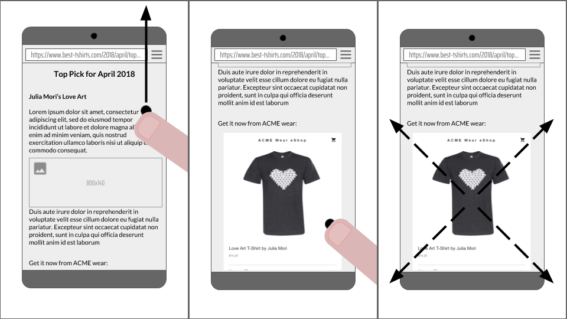

# [portals][commit] [![explain]][source] [![translate-svg]][translate-list]

[explain]: http://llever.com/explain.svg
[source]: https://github.com/chinanf-boy/Source-Explain
[translate-svg]: http://llever.com/translate.svg
[translate-list]: https://github.com/chinanf-boy/chinese-translate-list

「 关于在站点或页面之间启用无缝导航的提议 」

<!-- doc-templite START generated -->
<!-- time = '2018 6.29' -->

翻译的原文 | 与日期 | 最新更新 | 更多
---|---|---|---
[commit] | ⏰ 2018 6.29 | ![last] | [中文翻译][more]
<!-- doc-templite END generated -->

[last]: https://img.shields.io/github/last-commit/KenjiBaheux/portals.svg
[commit]: https://github.com/KenjiBaheux/portals/tree/44356d1398180968b37d8d6c770fbee6702fe06a
[more]: https://github.com/chinanf-boy/chinese-translate-list

---

## 生活

[help me live , live need money 💰](https://github.com/chinanf-boy/live-need-money)

---

<!-- START doctoc generated TOC please keep comment here to allow auto update -->
<!-- DON'T EDIT THIS SECTION, INSTEAD RE-RUN doctoc TO UPDATE -->


- [门户-portals](#%E9%97%A8%E6%88%B7-portals)
  - [校对🀄️](#%E6%A0%A1%E5%AF%B9%EF%B8%8F)

<!-- END doctoc generated TOC please keep comment here to allow auto update -->

---


# 门户-portals

门户网站 是一个非常早期的提案,可以在 网站或网页 之间实现无缝导航. 特别是,该提议使页面 能够将 另一页面插入显示,并在插入状态和导航状态之间执行无缝转换. 

详细看 **[解释`en`](https://github.com/KenjiBaheux/portals/blob/master/explainer.md)**. 


## 校对🀄️

- ⏰ 2018 7.19 开始

**1/3**

# `portal`

**发布时间:** 2018年4月25日, **更新:** N/A

`portal`网站的名称是暂定的,提案是非常早期的阶段. 需要反馈!



## tl;dr: 

这是一个启用 站点或页面之间 无缝导航的提议. 特别是,该提议使页面能够将另一页面显示为插入,并在 插入状态和导航状态 之间执行无缝转换. 

`document`可以包含呈现在`portal`上下文中加载的`document`的元素: 

```html
<portal id="myPortal" src="https://www.example.com/"></portal>
```

像一个 frame ,你可以使用`postMessage`与 `portal`上下文中 加载的`document`进行通信. 

与 frame 不同,`portal`网站可以*活性*,导致顶级浏览上下文导航,用`portal`替换其`document`. 

```js
myPortal.activate({ data: [...] });
```

此时,用户将观察到他们的浏览器已导航到`https://www.example.com/`. `document`在激活时会收到事件. 它可以使用此事件从其接收数据*前任-predecessor* (之前占据选项卡的`document`) ,甚至将其移动到`portal`上下文中. 

```js
window.addEventListener('portalactivate', e => {
  let predecessor = e.adoptPredecessor(document);
  console.assert(predecessor instanceof HTMLPortalElement);
  document.body.appendChild(predecessor);
});
```

### 目标

启用无缝导航: 

-   能从页面 展示 作为插入的 已知portal位置
-   联系 多个页面间的 portal

### 非目标

我们认为以下项目超出范围: 

-   指定导航模式,例如 旋转木马,无限列表. 用户体验模式来来去去,我们不希望阻碍创新 或 花时间在一个可能在几年内过时的模式. 
-   指定 转换 或 定义与转换相关的API: 该提案假定 现有动画和DOM操作 足以创建引人注目的用户体验. 我们可能会发现重要的差距,但应通过单独的努力来解决这些差距,以避免过度具体解答
-   托管任意未经修改的网页,保证隐私和性能. 虽然我们有兴趣允许嵌入器 对 `portal`上下文中的`document`应用的 其他限制,但我们预计页面可能需要修改才能在此类模式下工作. Chrome在预渲染方面的经验表明,透明地解决这个问题非常困难. 

## 考虑的替代方案

### iframe promotion

iframe promotion 是提供API 将 `iframe` 成为顶级`document`的想法. 

前段时间,Chromium工程师[试验](https://bugs.webkit.org/show_bug.cgi?id=32848)有这样的功能,但最终[去除](https://bugs.webkit.org/show_bug.cgi?id=81590),因为它变成了安全问题的根源,并为代码库增加了显着的复杂性. 

今天在 Chrome 中实现它仍然会非常复杂,并且在整个代码库中违背许多隐藏的假设. 我们相信这将再次导致不断的安全漏洞. 此外,由于类似的原因,此功能似乎很可能在其他浏览器中很棘手且有问题. 

### 全屏iframe

这里的想法是使 iframe 看起来像是主`document`,并在地址栏中反映出该状态. 具体而言,该提案建议扩展`requestFullscreen`,并能够选择显示 更多系统和浏览器UI,这将允许 iframe 使用整个窗口. 这种方法存在一些问题,特别是主`document`仍处于活动状态,而其中一个 iframe 显示为"全屏"就有问题. 

## 参考

-   [Promotable-可推广 的 iframe (WICG讨论) ](https://discourse.wicg.io/t/proposal-for-promotable-iframe/2375/11)

## 致谢

贡献和见解来自: Domenic Denicola,Jake Archibald,Jeffrey Yasskin,Jeremy Roman,Lucas Gadani,Ojan Vafai,Rick Byers,Yehuda Katz (@wycats) . 
