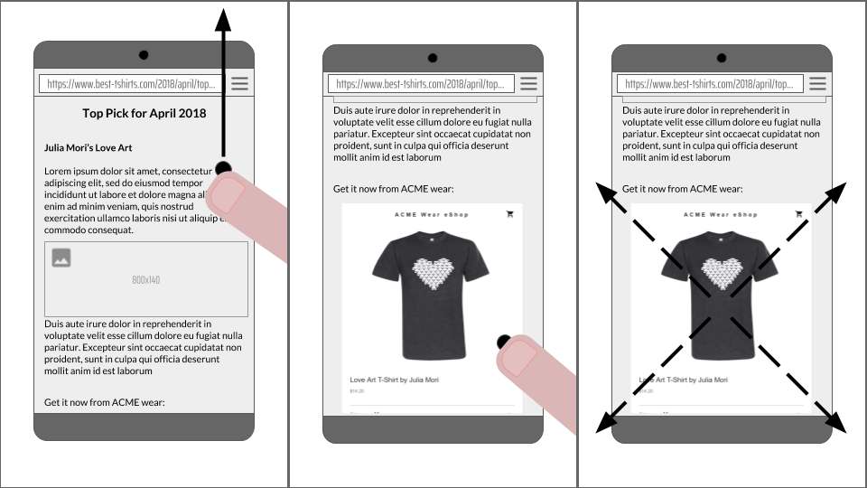
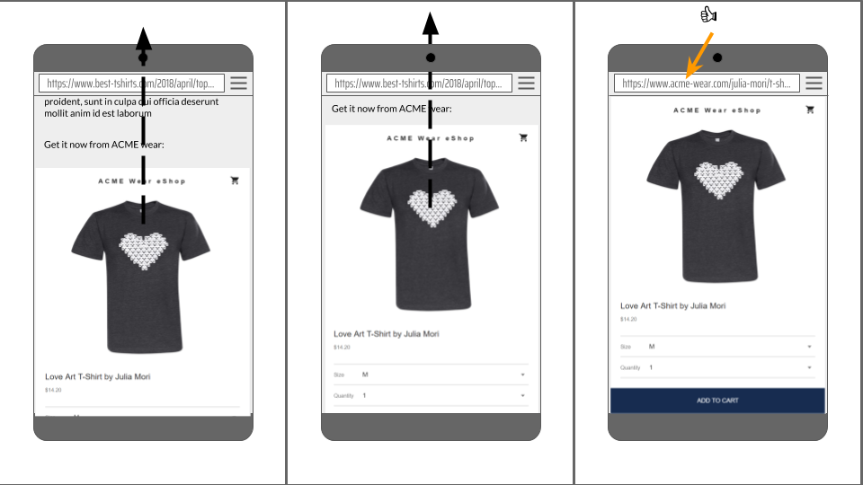

# 门户

**发布时间: **2018年4月25日,**更新: **N / A

门户网站的名称是暂定的,提案是非常早期的阶段. 需要反馈!



## TL;博士: 

这是一个启用站点或页面之间无缝导航的提议. 特别是,该提议使页面能够将另一页面显示为插入,并在插入状态和导航状态之间执行无缝转换. 

文档可以包含呈现在门户上下文中加载的文档的元素: 

```html
<portal id="myPortal" src="https://www.example.com/"></portal>
```

像一个框架,你可以使用`postMessage`与门户上下文中加载的文档进行通信. 

与框架不同,门户网站可以*活性*,导致顶级浏览上下文导航,用门户替换其文档. 

```js
myPortal.activate({ data: [...] });
```

此时,用户将观察到他们的浏览器已导航到`https://www.example.com/`. 文档在激活时会收到事件. 它可以使用此事件从其接收数据*前任* (之前占据选项卡的文档) ,甚至将其移动到门户上下文中. 

```js
window.addEventListener('portalactivate', e => {
  let predecessor = e.adoptPredecessor(document);
  console.assert(predecessor instanceof HTMLPortalElement);
  document.body.appendChild(predecessor);
});
```

### 目标

启用无缝导航: 

-   从显示门户网站感知目标的页面作为插入
-   在门户网站感知网站的页面之间

### 非目标

我们认为以下项目超出范围: 

-   指定导航模式,例如旋转木马,无限列表. 用户体验模式来来去去,我们不希望阻碍创新或花时间在一个可能在几年内过时的模式. 
-   指定转换或定义与转换相关的API: 该提案假定现有动画和DOM操作足以创建引人注目的用户体验. 我们可能会发现重要的差距,但应通过单独的努力来解决这些差距,以避免过度具体的解
-   托管任意未经修改的网页,保证隐私和性能. 虽然我们有兴趣允许嵌入器对门户上下文中的文档应用其他限制,但我们预计页面可能需要修改才能在此类模式下工作. Chrome在预渲染方面的经验表明,透明地解决这个问题非常困难. 

## 考虑的替代方案

### iframe推广

iframe促销是提供API以促进iframe成为顶级文档的想法. 

前段时间,Chromium工程师[试验](https://bugs.webkit.org/show_bug.cgi?id=32848)有这样的功能,但最终[去除](https://bugs.webkit.org/show_bug.cgi?id=81590)因为它变成了安全问题的根源,并为代码库增加了显着的复杂性. 

今天在Chrome中实现它仍然会非常复杂,并且在整个代码库中违背许多隐藏的假设. 我们相信这将再次导致不断的安全漏洞. 此外,由于类似的原因,此功能似乎很可能在其他浏览器中很棘手且有问题. 

### 全屏iframe

这里的想法是使iframe看起来好像是主文档并在地址栏中反映出该状态. 具体而言,该提案建议扩展requestFullscreen,并能够选择显示更多系统和浏览器UI,这将允许iframe使用整个视口. 这种方法存在一些问题,特别是主文档仍处于活动状态,而其中一个iframe显示为"全屏"被视为有问题. 

## 参考

-   [可推广的iframe (WICG讨论) ](https://discourse.wicg.io/t/proposal-for-promotable-iframe/2375/11)

## 致谢

贡献和见解来自: Domenic Denicola,Jake Archibald,Jeffrey Yasskin,Jeremy Roman,Lucas Gadani,Ojan Vafai,Rick Byers,Yehuda Katz (@wycats) . 
